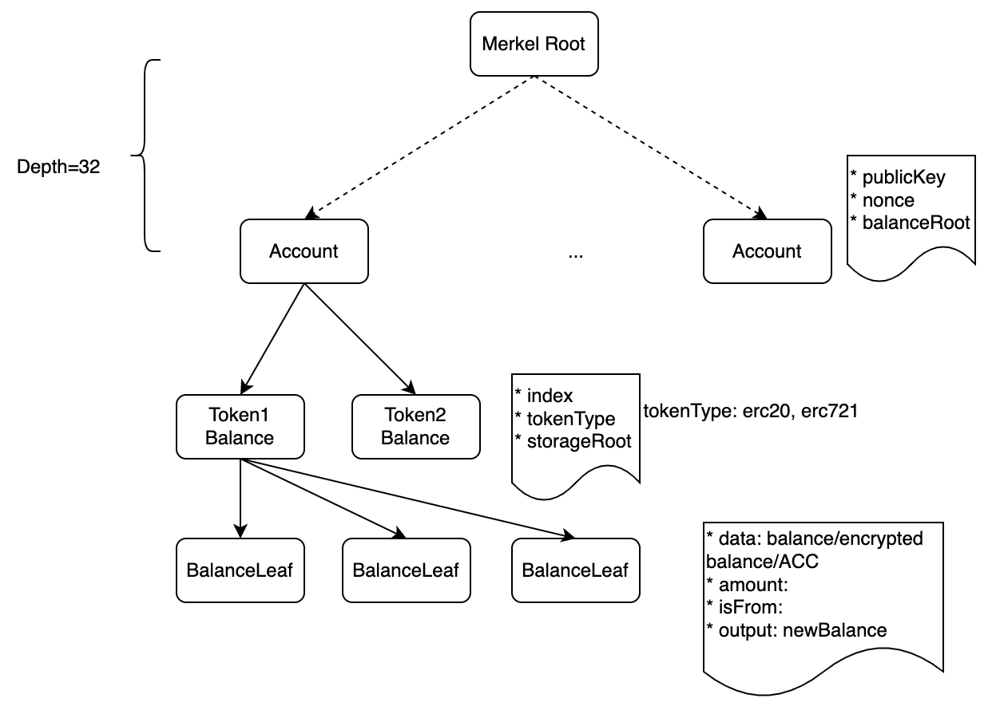
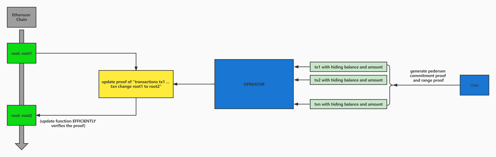

# Eigen ZK-ZKRollup

Eigen ZK-ZKRollup provides confidential transaction for users with low gas cost. building on Stealth Address and zkSnark.
The circuits is written by Circom, and the verifier is generated by [eigen zkit](https://github.com/0xEigenLabs/eigen-zkvm/tree/main/zkit).

## Archtecture

Apart from the TX Tree and Account Tree, we extend the operations on the leaf nodes to abstract storage layer for all kinds of assets' operation, including normal and confidential ERC20, ERC721 and Swap etc.

### CERC20

CERC20 realizes amount hiding through Pedersen Commitment. At the same time, due to the homomorphism of Pedersen Commitment, it is guaranteed that add and sub operation can be performed on the basis of commitment. When the user makes a transfer, the user generates a proof in order to prove    he generates the right balance comitment and transaction amount commitment and, at the same time, has enough balance. Then the user submits to the operator for verification. We assume that the operator is semi-honest, that is to say, the operator wants to obtain the amount transferred by the user, but when the operator gets the corresponding input, it will execute the correct logic to update state. After the operator gets the content submitted by the user, it will generate a proof of the state update, and then submit it to the blockchain for verification.

## Spec
The new spec isn't open-source yet. the old Rollup Spec can be found [here](./docs/README.old.md).

## Test
1. Clone [eigen zkit](https://github.com/0xEigenLabs/eigen-zkvm/tree/main/zkit), run `cargo build --release` to build `zkit` and expose it to $PATH
2. Use the `zkit_test_xxx.sh` to generate the corresponding verifier;
3. Run `yarn test`.
